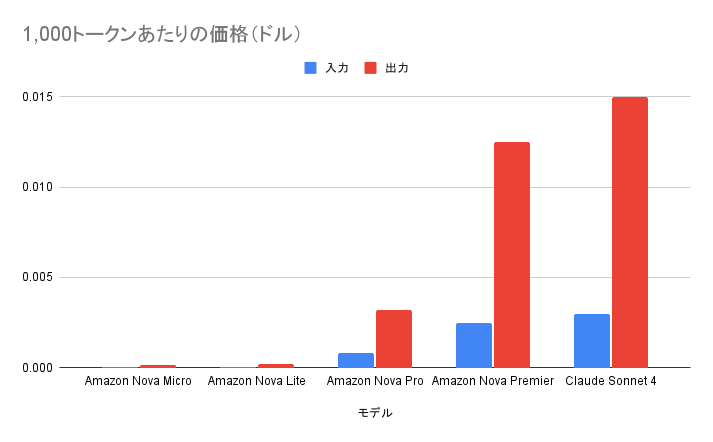

# Amazon Nova がいい

<div class="flush-right">
森田 和明
</div>

Amazon Nova発表時のニュース記事の一部をふたつのLLMで翻訳しました。みなさんはどちらがお好みですか？

「LLM A」での翻訳

```
すべてのAmazon Novaモデルは非常に能力が高く、高速で、コスト効率が良く、顧客のシステムやデータと簡単に使用できるよう設計されています。200以上の言語と複数のモダリティにわたる幅広いタスクをサポートしています。
```

「LLM B」での翻訳

```
すべてのAmazon Novaモデルは非常に高性能で、高速かつコスト効率が良く、顧客のシステムやデータと簡単に連携できるよう設計されています。これらのモデルは200の言語と複数のモダリティにわたって幅広いタスクをサポートしています。
```

どちらも自然な翻訳だと感じませんか？少なくとも私はどちらも自然で、精度も十分だと感じました。

出力の品質は同等ですが、生成にかかった料金は一方が 0.00001064 ドルでもう一方が 0.001731 ドル。なんと 162 倍もの差があります。生成スピードも約 6 倍の差があります。

## Amazon Nova は早くて安い

種明かしをすると、LLM AはAmazon Nova Microで、LLM BはClaude Sonnet 4です。Amazon Novaの特徴は「程よい性能のモデルが早くて安い」です。どこかの牛丼屋さんのキャッチコピーみたいですが、そんな感じです。

価格ですが「ちょっと安い」程度ではありません。「めちゃくちゃ安い」です。グラフを見てください。



Amazon Nova MicroとAmazon Nova Liteはもはや棒が見えません（笑）。ちなみにClaude Opus 4はClaude Sonnet 4の5倍の価格なので、もっと差があります。

## Amazon Nova の推しポイント

早くて安い以外で Amazon Nova の推しポイントを紹介します。

まずは、日本語を正式にサポートしています。LLM によっては英語でのベンチマークが良かったとしても日本語に対応していないものもあります。例えば、一時期話題になった DeepSeek-R1の場合、対応言語は英語と中国語のみです。そのため、日本語で質問しても英語や中国語が混ざった文章で回答されることがよくあります。

他には、画像をインプットに含めることもできます。画像中の境界を正確に抽出するようにトレーニングされているので、例えば、画像の中の顔の座標位置（x, y, width, height）を正確に取得するような使い方が可能です。日本語テキストの読み取りは残念ながら対応していないので、バージョンアップに期待です。

## まとめ

一人でちょっと試す程度であればあまり気になりませんが、企業内で全社員が使用する場合や製品サービスに組み込むとなると、費用も無視できません。ちょっとした翻訳タスクやチャットなど、タスクによってはAmazon Novaでも十分価値があると思いますので、検討の対象に含めることをおすすめします。

#### 著者紹介

---

<div class="author-profile">
    
    <div>
        <div>
            <b>森田 和明</b>
            @moritalous
        </div>
    </div>
</div>
<p style="margin-top: 0.5em; margin-bottom: 2em;">
Amazon Bedrock 生成AIアプリ開発入門 [AWS深掘りガイド]の共著者のひとりです。Qiitaに毎週投稿継続中。いいねください。
</p>
