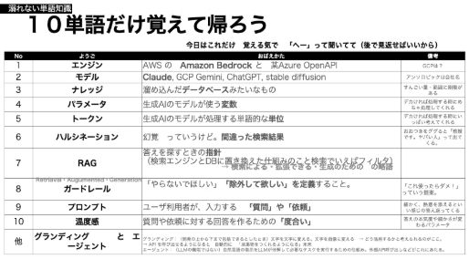

# ４行ではじめるBedrock（その②　LLMってなに）

おーつき

 

ぼくもAWSユーザの端くれ、みなに　Bedrockを始める際にいくつか立ちすくんだところから、いけんじゃね？っておもったTipsを共有しようと思います。
特に以下です
* いろんなLLMのサービスがあるけど「なんかみんなさわいでるぞ」　・・・ここは前章で　LLMは怖くないんだなを学びました
* 使ってる？使えるの？どう使う？　・・・　そりゃ「チャットのようにつかってる」のは会社でもみなつかいはじめてる。でもAWSユーザーとして使い始める、その一歩が必要です。このあたりは次の章で書こうと思います。まじ簡単！
* 単語におぼれる　・・・　世に書く用語が多くて溺れる。おまけにその単語知らないでかいわにはいってくと「おっ。おう知ってるぜ」って顔しないといけなかったあたり

そう単語に溺れるんです。なので　今日みなさん読んでおぼえて「お母さんに自慢話できる」を目標に共有したいと思います。

## １０単語まず覚えたら　最初の一歩はなんとかなる
1. 今日ここまで覚えたら「へー」でいい。次に行くべきは　25年にでてくる　MCPやエージェント　なんて単語を吸収していけば良いです。

## お勧めコンテンツ
1. 森田さんのqiita 会社の同僚、恐ろしい勢いでQiita にBedrockを中心に愛なのか狂気なのか、AWS界隈のLLMの利用方法を紹介してくれる。
    - https://qiita.com/morikaz
1. Bedrock生成AIアプリ開発入門の著者、AWS界隈の有名人、日本で最速記事をアップロードしてる人のQiita。一歩め踏み出したら、ここから
    - https://qiita.com/minorun365

*それでは良い！　LLMライフをお送りください。* 

### 著者紹介
---

    
    

            <b>おーつき</b>
            @ 大槻　剛
    

某SIer会社で、クラウド&コンテナ xDevOps推進エバンジェリストとして、2024年 AWS 認定 Ambassadors 兼 AWS Japan認定Top Engineerを務めています。
アプリケーションフレームワークエンジニアとしてキャリアをスタートしクラウドやコンテナ技術とIaCに関する活動やパブリックイベントで皆の技術力底力アップを推進中です。

