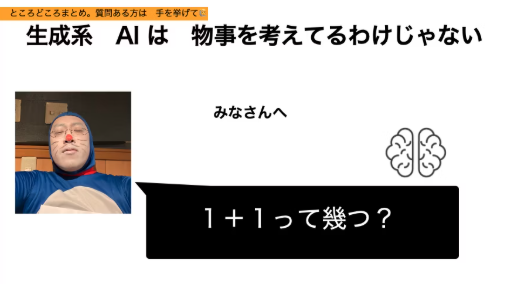
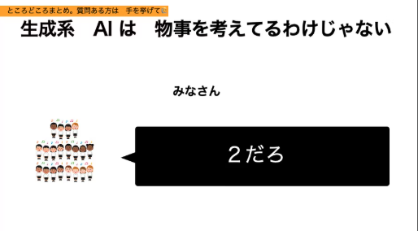
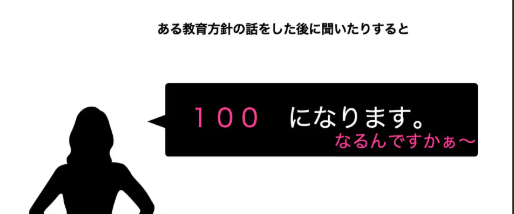
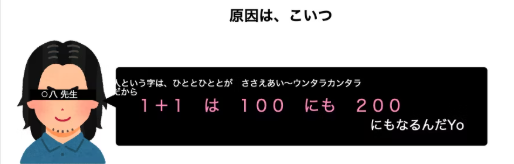
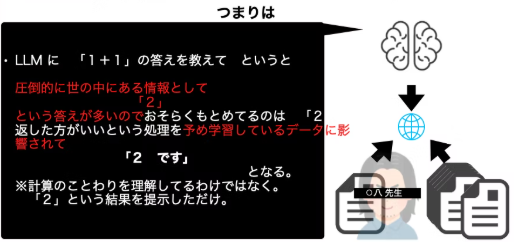
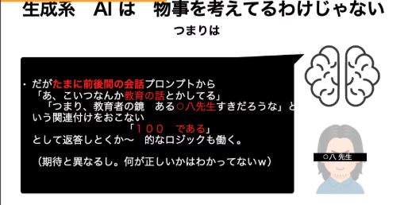
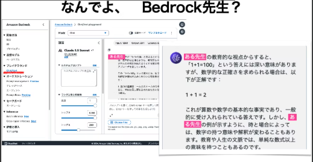
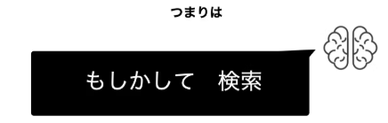

# ４行ではじめるBedrock（その①　LLMってなに）

おーつき

## Share My Lesson
こんにちは、「えっ！？先輩そんだけで実装できるんすか？」
- LLMを楽しむのに皆に覚えて欲しいことを３回に分けて紹介しようと思います（とおもったら追加で25年に入ってからの拡張３つも追加したい）
    1. １＋１はいくつ？　生成系AIは　物事を考えてるわけじゃない　を知ろう。
    1. 用語が多くて溺れる　１０単語を覚えていこう
    1. 四行ではじめるBedrock！
    1. 2025年 １０単語を追加で覚えていこう　★★他の皆様がかいてもいいかもしれないですね★★
    1. 25年で　LLMがやるべきことを　re:invent2024から感じ取ろう　★★他の皆様が書いてもいいかもですね★★
    1. 体のいい新人のようなLLMとの付き合い方　★★他の皆様が書いてもいいかもですね★★
- 

### ①　生成系AIは　物事を考えてるわけじゃない　
* さてみなさん、１＋１はいくつでしょう。
  こたえは「２」となりますが、LLMを知る上で知っておくといいことが２つあります。でもねLLM をはじめ推論というアルゴリズムを使います。その推論を利用するには特徴という単語や文法、文章の特徴を覚えておき、さらに回答する時には人間がいい感じによむことのできる答えを推論しながら生成するため　実際には計算をしているわけではなく。いい感じの答えを返すのです。・・・と言ってもよくわからなかったので、おーつきは　ある有名な教師のドラマを例に例えて納得したのがきっかけで。こいつを覚えておくと皆わかりやすいかなと思うので共有します。

 
ここで問題です

はい！タイムアップ

それではこれが　推論と特徴を利用した　LLMだとこんな答えが買えることがあります

ここまできくと　Googleとかで　もしかして検索って機能を知ってると思いますが、アレに近いんですよね。
世界中の検索を皆が検索している特徴や統計を取り出しておいて、ある質問したい単語（特徴）にひもづけて様々なサジェストを（推論）一覧でいい感じに表示するこの感じ。

ここまできたら、LLMの基礎はまなんだようなもの、ここから皆の推し・Tips・など　AWSユーザーから見たLLM１００本ノック始めていきましょう

## お勧めコンテンツ3選
1. 「4行で覚えるBedrock」　・・・　自分のサイトですがqiita で結構なプレビュー数をいただきこちらにこちらのダイジェストをもう少し詳しく書いたものを載せておきます
    - https://qiita.com/plustick/items/751b154c212e34d000da

*それでは良い！　DevOpsライフをお送りください。* 

### 著者紹介
---

    
    

            <b>おーつき</b>
            @ 大槻　剛
    

某SIer会社で、クラウド&コンテナ xDevOps推進エバンジェリストとして、2024年 AWS 認定 Ambassadors 兼 AWS Japan認定Top Engineerを務めています。
アプリケーションフレームワークエンジニアとしてキャリアをスタートしクラウドやコンテナ技術とIaCに関する活動やパブリックイベントで皆の技術力底力アップを推進中です。

