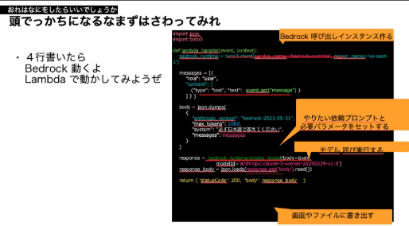

# ４行ではじめるBedrock（その③　たった四行ではじめよう）

おーつき

 

（文章見直します）

* さぁ、AWSをはじめたのなら　Bedrock呼べることしっとこう。
* えっ！？先輩　たった四行で使えるようになって本当ですか？本当です。
* Lambda から　Bedrock呼んでみて、ひとまずのアプリケーション作れる可能性を獲得しよう。いろんなツールがあっても基礎をまなぶ０から１って大切でうｓ。

## 本当か?まず、Lambda とBedrockよういして　
1. 四行なにをかくのか。まず以下のコードを眺めてください（たったこれだけ）

 

** 先にBedrock の画面から モデルを有効にしておくことをお勧めいたします。
- コードまじ４行解説（Lambdaの上で　Pythonで書いた例）
    1. AWSユーザーならおなじみ Pythonのライブラリboto3 で bedrockインスタンスを作成する。
    1. bedrock に質問する内容をJsonで作成する。（利用するモデル：Claudeとか。呼び出しトークンの数などオプション。モデルに事前につげる制限なんかを含めると答えの精度が変わる）
    1.  モデル自体を invoke で呼び出す。　戻りのレスポンスに　LLMの返答が含まれて返ってくることを期待しよう！
    1. LLM(文章)のモデルを呼んだ場合は、戻りに　文章が含まれているので抽出して　これを利用するだけだYo。

 

## こうなったら　次のステップへ
1. うちのAlexa他よりすごいよ！　スキルにBedrockを追加して、Alexa+を先取り！
    - https://speakerdeck.com/otsuki/utinoalexa-minnanoyorisugoiyo

*それでは良い！　LLMライフをお送りください。* 

### 著者紹介
---

    
    

            <b>おーつき</b>
            @ 大槻　剛
    

某SIer会社で、クラウド&コンテナ xDevOps推進エバンジェリストとして、2024年 AWS 認定 Ambassadors 兼 AWS Japan認定Top Engineerを務めています。
アプリケーションフレームワークエンジニアとしてキャリアをスタートしクラウドやコンテナ技術とIaCに関する活動やパブリックイベントで皆の技術力底力アップを推進中です。

