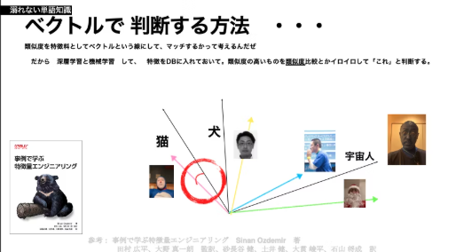

# 特徴量って何？

おーつき

 

（文章見直します）LLMってのは　ML/DLの頃から　特徴量というのを利用しているらしい。とは言っても僕はそういう専門分野よくわかってない。
でもこないだ「特徴エンジニアリング」という書籍を読んだ時に　「おー　特徴量とベクトルってこう使い理解するのか」って思ったことを共有したいと思う。

* ベクトルというものをつかうだけではないらしい、だいたい１０個くらい　こういう特徴を判断する方法があって、これらを使いこなすと特徴量から推論に繋げることができる。
* では、犬・猫・宇宙人という特徴を学習したモデルがいたとした時、僕の顔写真をつかって特徴がどう判定されるのか紐解いていこう。

## ベクトルと　特徴の差を角度で抽出して、似たものを判断する（すごい方法）
1. みなさまベクトルをご存知ですか。　（簡単にいうと　XとY軸の座標にある値と　その線に強さ　をくわえたものです・・・文章直します）
1. このベクトルに、 〜うんたらかんたら
1. 猫と　ド⭕️えもんの格好をした僕の写真の角度が一番　小さい。　だから　このド⭕️えもんの格好をしたぼくの特徴をとらえて、　この画像（文章なら単語、文法なんか）を特徴料からはんだんしてうんたらかんたら（ごめんなさい　深夜になったので描き直します）
 

## おすすめ書籍
1. 事例で学ぶ特徴量エンジニアリング:この本よむと　特徴からいろいろな値を導き出して　みたいなことが、算数苦手な僕でもわかっちゃうすごい本でした。
    - https://amzn.asia/d/6MUeWMy

*それでは良い！　LLMライフをお送りください。* 

### 著者紹介
---

    
    

            <b>おーつき</b>
            @ 大槻　剛
    

某SIer会社で、クラウド&コンテナ xDevOps推進エバンジェリストとして、2024年 AWS 認定 Ambassadors 兼 AWS Japan認定Top Engineerを務めています。
アプリケーションフレームワークエンジニアとしてキャリアをスタートしクラウドやコンテナ技術とIaCに関する活動やパブリックイベントで皆の技術力底力アップを推進中です。

