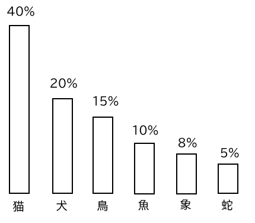
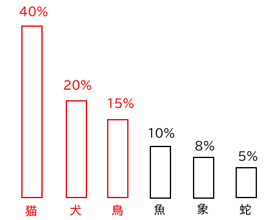
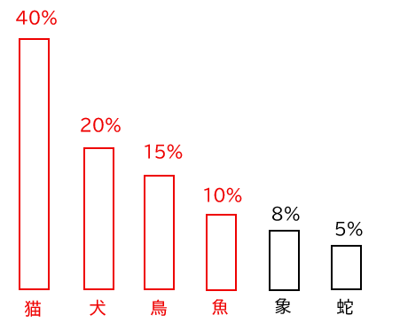

# Top P / Top K について

横山 昂平

LLMの推論に利用されるパラメータとして「Top P / Top K」がありますが、「なんとなーく使ってる」という人もいらっしゃるかもしれません。  
そこで、ここでおさらいしていきましょう。  

## LLMが次の単語を選ぶ仕組み

まず、LLMがどのように次の単語を選んでいるかを理解しましょう。

LLMは文章を生成する際、次に来る可能性のある全ての単語に対して確率を計算します。

例えば、下記のような確率分布からどの単語を選ぶかを決めるのがTop PとTop Kの役割です。

## Top Pとは

**Top P**（Nucleus Sampling）は、確率の累積値がP%に達するまでの単語を候補として残す手法です。

### 例：Top P = 0.75（75%）の場合

確率を高い順に累積していき、合計が75%になるまでが候補となります。

## Top Kとは

**Top K**は、確率が高い上位K個の単語のみを候補として残し、それ以外を除外する手法です。

### 例：Top K = 4の場合

上記の例で Top K = 4 に設定すると、上位4つの単語のみから次の単語が選ばれます。

## Top PとTop Kの違い

| 項目 | Top P | Top K |
|------|-------|-------|
| 特徴 | 低確率の単語を効果的に除外 | 常にK個選択するシンプルな仕組み |
| 適用場面 | 確率分布に応じて調整したい | 候補数を制限したい |

#### 著者紹介
---

    
    

        

            <b>横山 昂平</b>
            @yokoykou99
        

    

AWSを活用した生成AI・Webアプリ・データ分析基盤の構築に取り組んでいます。  
2026年AWS All Certifications取得とTop Engineerを目指して日々挑戦中！

