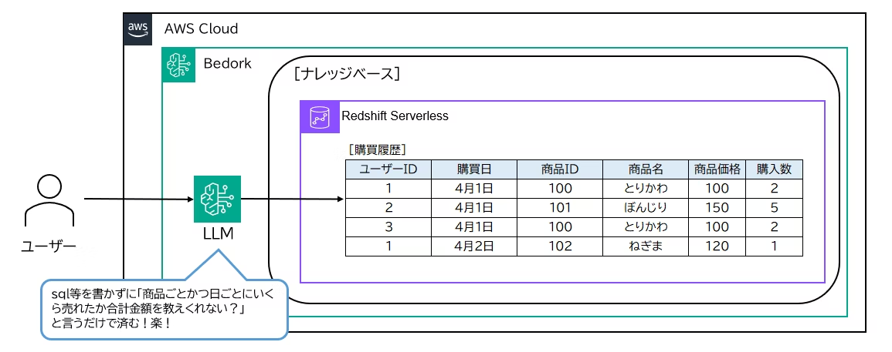
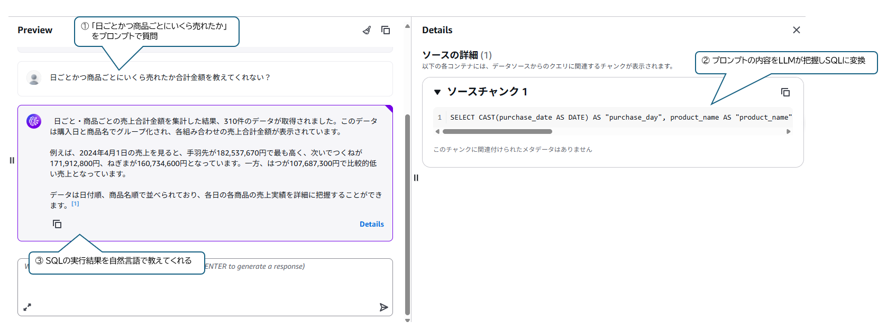

# Text to SQL で日本語からSQLを自動生成

横山 昂平

日々の業務の中で、「ちょっとした集計やデータ確認するのにSQL書くのめんどくさいなー」
と思っているのは僕だけではないはず・・・

そんなあなたに日本語で依頼するだけでデータの確認ができる「Text to SQL」をご紹介します！

## Text to SQL でできること

自然言語での下記のような問い合わせをすることで、適切なSQLクエリに変換されてデータベースから結果を取得できます。

- 「先月の売上合計を教えて」→ SELECT文を自動生成
- 「顧客別の注文件数を多い順に表示して」→ GROUP BY、ORDER BY付きのクエリを生成
- 複雑な結合条件も自然言語で指定可能

今回は AWS Bedrock でモデルを呼び出して、Amazon Redshift にクエリを投げる構成で試してみました。

## こういう結果が得られます

実際にやってみた結果がこちらです。

上の画像では、日本語での問い合わせ「日ごとかつ商品ごとにいくら売れたか合計金額を教えて」に対して、システムが自動的に適切なSQLクエリを生成し、データベースから結果を取得している様子が確認できます。

**実行の流れ：**
1. **自然言語入力**: 「日ごとかつ商品ごとにいくら売れたか合計金額を教えて」
2. **SQL生成&実行**: LLMが適切なSELECT文を生成し、Redshiftで実行
3. **結果表示**: 売上データが表形式で表示

このように、SQLの知識がなくても、日常的な日本語でデータベースに問い合わせができることが実証されています。複雑な集計や条件指定も、自然な日本語で表現するだけで、システムが適切なSQL文に変換してくれる非エンジニアの方に優しい機能です。

## さらに詳しく知りたい方へ

概要図と実行結果を載せていますが、実際の構築方法や大量データに対しての性能などが気になる方は
下記Qiitaのリンクに記載しておりますので、興味があれば是非ご覧ください！

https://qiita.com/NiNe99/items/c50909aeee01def5835b

#### 著者紹介
---

    
    

        

            <b>横山 昂平</b>
            @NiNe99
        

    

AWSを活用した生成AI・Webアプリ・データ分析基盤の構築に取り組んでいます。  
2026年AWS All Certifications取得とTop Engineerを目指して日々挑戦中！

