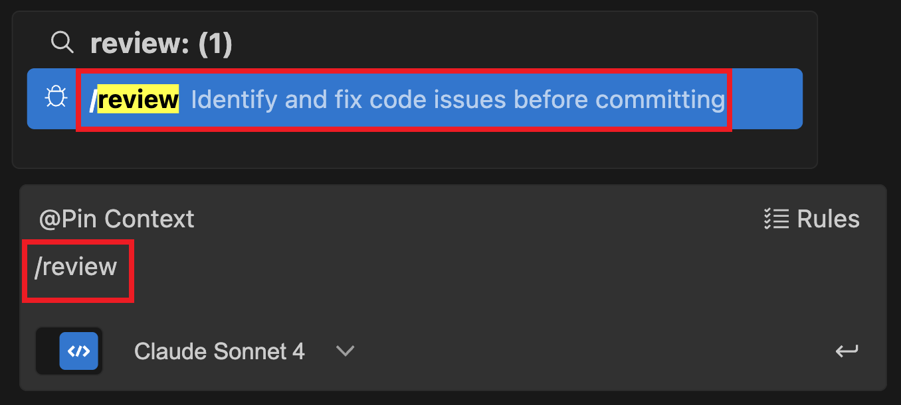
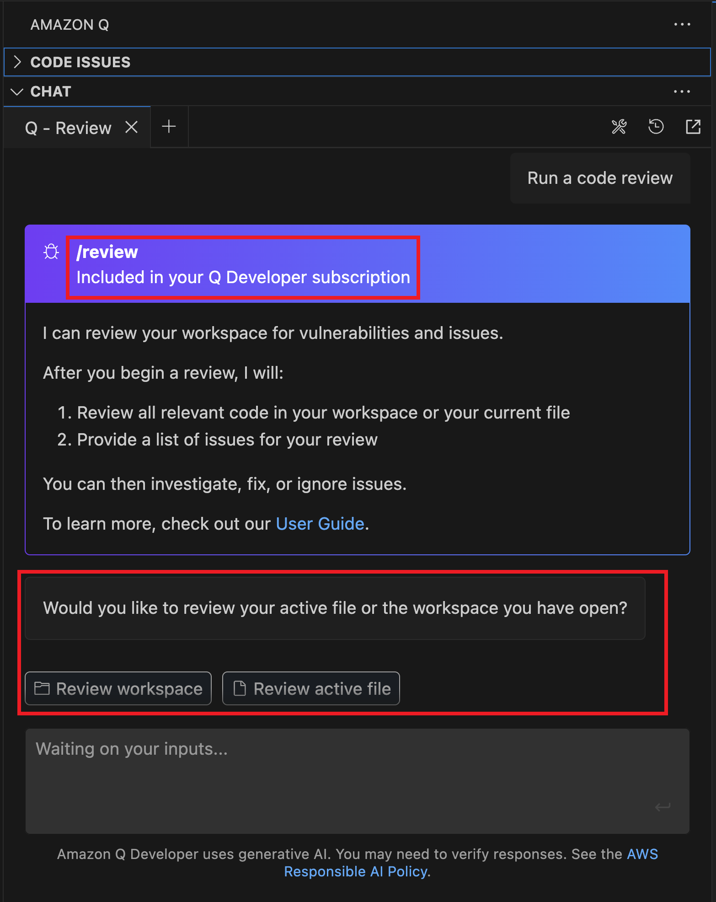
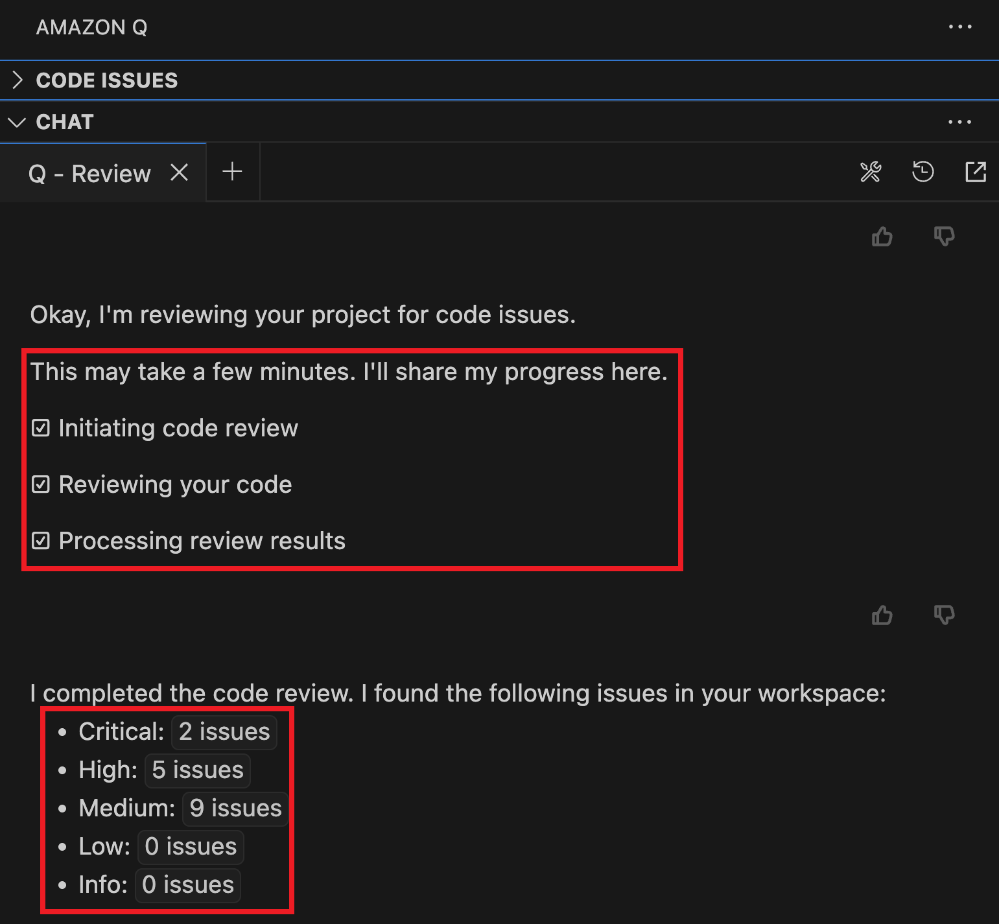
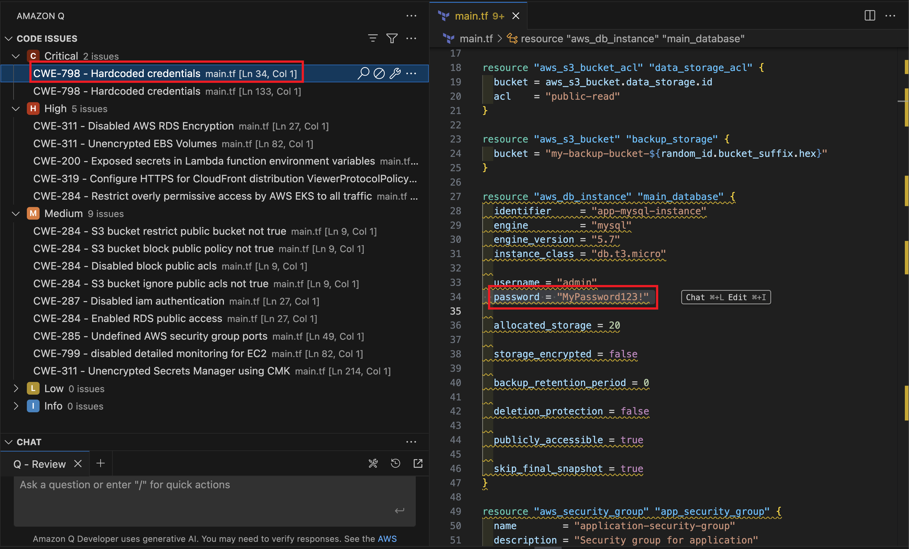
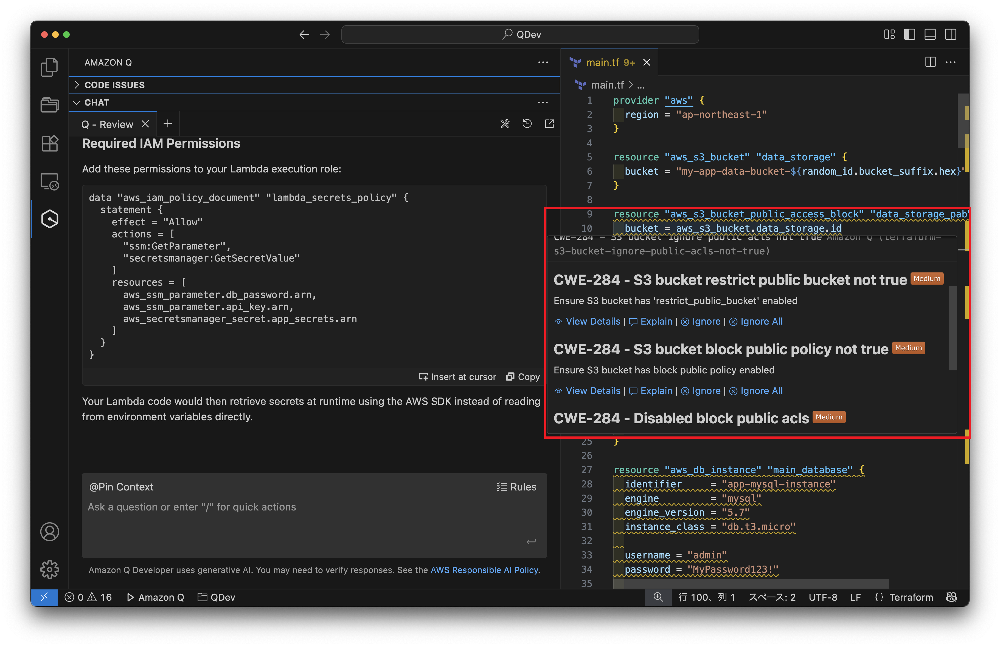

# Amazon Q Developerの脆弱性診断(その① /review編)

Yuuuuuuu

## はじめに
皆さんTerraform書いていますか？書いている、大変素晴らしいです
では、そのコードは堅牢ですか？脆弱ではないですか？

すべてにおいて、このコードに脆弱性がないと言い切ることはできないように思いますし、コードが長大に、複雑になればなるほどその評価は苦しく、時間がかかってしまい、抜け漏れが発生する可能性が高くなります

じゃあどうするか、そう、最近流行りのAIを使ってみましょう

ここでは、Amazon Q Developerの標準機能である、"/review"というスラッシュコマンドを使い、その対応範囲や表現についてみていきます

## Amazon Q Developerの"/review"が確認する範囲
- SAST スキャン
    - ソースコードのセキュリティ上の脆弱性を検出します
- シークレット検出
    - コード内の機密情報や機密情報の漏洩を防止します
- **IaC の問題** ←今回のメイン
    - インフラストラクチャファイルのセキュリティ体制を評価します
    - この後Terraformの例を示しますが、そのほかAWS純正のIaCであるCloudFormationやCDKでも使えます
- コード品質の問題
    - コードが品質、保守性、効率の基準を満たしていることを確認します
- コードデプロイリスク
    - コードのデプロイに関連するリスクを評価します
- ソフトウェアコンポジション分析 (SCA)
    - サードパーティーのコードを評価します

また、今回Pro版を使用しましたが、"/review"は回数制限はあるもののFree版でも利用可能です
ぜひ面白そうと思われた方は"/review"を連打してくださいね！

Amazon Qの詳細はこちらをご覧ください

https://docs.aws.amazon.com/ja_jp/amazonq/latest/qdeveloper-ug/code-reviews.html#issue-types

## 脆弱なコードの紹介
:::note alert
該当コードはたくさんの脆弱性を含んでいます！！！
そのため、今回のような脆弱性発見の用途として使用してください
決してapplyしてみようと思わないでください！！！！！
:::

こちらにTerraformコードと、おまけでLambda用の脆弱なPythonコード(ZIP済み)を配置しています
※コードに含まれる脆弱性についても解説しています

https://github.com/yuuuuuuu168/terraform-vulnerability-examples

## Let's review！！
1. VS Codeの入力欄に"/review"と入力

2. 最初に、review対象がワークスペース(今作業をしているフォルダ)なのか、アクティブなファイルなのかが聞かれます

3. しばらく待っていると....reviewが終わり、計16個(Critical2個、High5個、Medium9個)の脆弱性が発見されました

4. 具体的な脆弱性ポイントを見てみると...例えばCriticalな脆弱性の一つに、ハードコードされたCredential(認証)が存在していることが指摘されています
何が問題かを指摘するだけでなく、Terraformコードのどこにその脆弱性が含まれているか、画面左のISSUESをクリックすると、画面右側でハイライトされるのはいいですね

5. VS Codeのコード上で波線がついている箇所にマウスカーソルをフォーカスさせると、そのリソース部分内で発生している脆弱性をpickすることができます。また、"Explain"をクリックすると、なぜそれが脆弱なのかの説明や、どうすれば良いかという提案までしてくれます

## review結果について
今回、細かい脆弱性を含めて、25個仕込んでいました
それに対して、一行単位で脆弱性を指摘する場合も、このブロックに脆弱性があるという場合もあるのですが、18個指摘していました
指摘は正しく、何が問題か、どうすれば良いかの記載があることはかなり便利だと感じました

一方で、指摘が漏れており、これはまずいのでは？となったものの例として、EC2インスタンスのIMDS v2がオプションとなっている箇所にコメントがなかったことですね
これは正直うーーーん...です
今時分、IMDS v2は必須だと言って欲しいです

なお、参考として、SQLインジェクションなどの脆弱性を含んだLambda用のPythonコードをZIP化して配置していましたが、これには特段指摘はありませんでした
やはり...というべきかもしれませんが、ZIP化されたファイルはAmazon Q Developerのレビュー対象外になるようなので、Lambdaコードの脆弱性チェックをさせたい場合は、".py"など、そのまま読める形で必ず渡しましょう

## おわりに
Amazon Q Developer、月に$20でここまでわかりやすいreviewができるというのは正直すごいなと思いました
プライベート、そしてあなたの会社でもし使えるのなら、一考の価値ありに思えます

一方で、プロンプトや脆弱性評価の項目がまだ英語ベースなのは、人によってはうーーん...という人もいるかもしれませんね

#### 著者紹介
---

    
    

        

            <b>Yuuuuuuu</b>
            @ec2_on_aws
        

    

趣味はAWS/Terraformに挑戦中  
AWS15冠(2024-2025)、Terraform1つ、OCI2冠、Azure1つ、Databricks1つ  
目指せCommunity Builder & Top Engineer!!  

